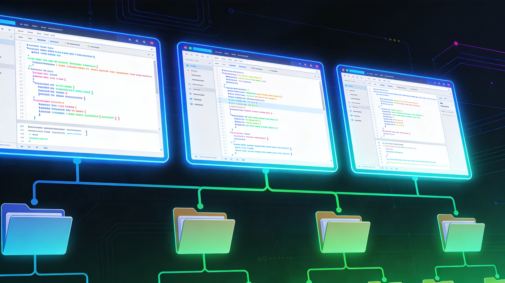
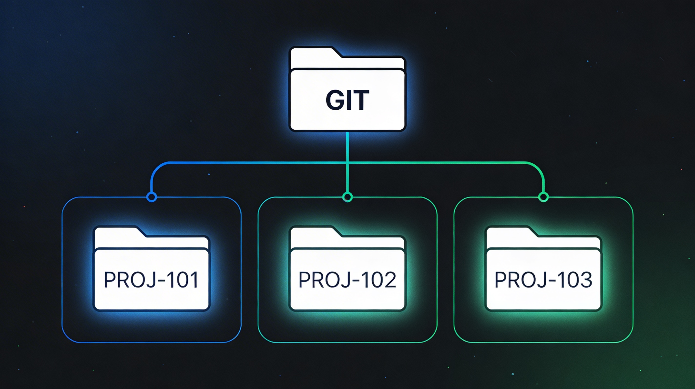

There's a moment every developer knows — you're deep in the zone, multiple things firing at once, and it all feels great. Until it doesn't.

That moment hit me recently, and it led me down a path that fundamentally changed how I manage parallel development work.

## The Setup: Two MCPs, One Big Idea

I'd already been running the **Jira MCP** with Cascade for a while, and it had quietly become indispensable — Cascade could read ticket details, understand acceptance criteria, and track work without me ever having to copy-paste context into the chat. It just knew what needed doing.

Then I hooked up the **GitHub MCP**. The moment the two were working together, something clicked. Cascade could now see my tickets *and* interact with my repositories as a first-class participant — opening PRs, reading review comments, managing branches. Joining the two was incredible. It stopped feeling like AI-assisted coding and started feeling like having a developer on the team who also handles all the minutia you never want to deal with.

Naturally, I wanted to see exactly how far I could push this combined workflow.

## The Excitement of Parallel AI Sessions

I had three Jira tickets sitting in my queue — all reasonably straightforward, well-scoped tasks. On a whim, I fired up three separate Cascade chat sessions and in each one simply said *"let's work on Jira ticket JIRA-123."* That was it. The Jira MCP handled the rest, pulling in all the context Cascade needed to get straight to work.

The results were genuinely impressive. Each session understood the requirements, produced solid code, and moved the work forward without much hand-holding. I was pumped. This felt like the future — parallel development running at a pace no single developer could match alone.

## When Parallel Becomes Chaos


Then came the cleanup.

With three sessions writing code across the same working directory, I ended up with a tangled pile of modified files — and it wasn't just different files per ticket. Multiple sessions had made edits to the **same files**, interleaving changes that belonged to completely different Jira tickets. Without AI in the mix, that could have been a very long afternoon of `git add -p`, manually crafting patches to surgically separate each ticket's changes.

Fortunately, because each Cascade session had been driven directly from its Jira ticket, it already had full context for exactly what it had written and why. I was able to ask it to reason through which changes belonged to which ticket, and it sorted it out accurately without any re-explanation from me. It handled it well — but it was still an entirely avoidable problem.

The problem wasn't the AI's code quality. Each session had done its job well. The problem was the environment: everything shared one working tree, and there was no structural boundary preventing the sessions from writing into each other's files.

## Enter Git Worktrees



After stepping back and thinking it through, the solution became clear: **git worktrees**.

If you're not familiar, `git worktree` is a Git feature that lets you check out multiple branches simultaneously, each in its own dedicated directory, all sharing the same underlying repository. No stashing, no branch-switching interruptions — just independent, isolated working environments living side by side.

The mapping is elegant:

- **One Jira ticket → one branch → one worktree**

Each Cascade session gets its own worktree. The AI works in a fully isolated directory. When the session is done, the changes are cleanly contained to that worktree's branch, with zero bleed-over into other tickets. The chaos I experienced simply can't happen in this model.

For those of us working across **multiple repositories** — which is common in microservices and enterprise environments — worktrees scale naturally. Each repo can have its own set of worktrees, giving you a clean, structured workspace even when a single feature ticket spans several codebases simultaneously.

## Taking It Further: Syncing PRs to Worktrees

Once the per-ticket worktree model clicked, I saw another opportunity. I asked Cascade to build a utility that automatically syncs all of my outstanding pull requests to local worktrees.

The result is a script that pulls down every open PR I have across my repos and provisions a corresponding worktree for each one. This transforms PR review and testing from a disruptive context-switch into a seamless parallel workflow. Whether I'm validating AI-suggested changes or reviewing feedback from teammates, I can jump into any PR's working environment instantly — no checkout gymnastics, no lost work, no stale state.

## The Workflow, Summarized

Here's how the updated flow looks in practice:

1. **Pick up a Jira ticket** → Cascade reads it via the Jira MCP and creates a branch and worktree:
   ```bash
   git worktree add ../project-TICKET-123 feature/TICKET-123
